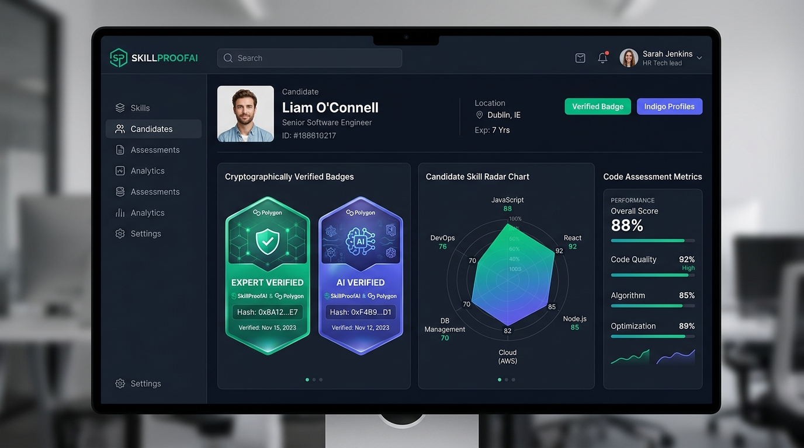
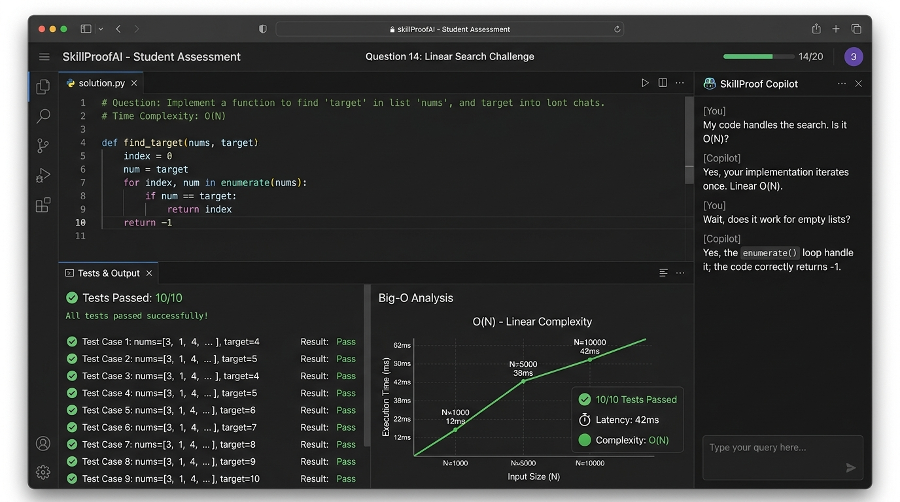
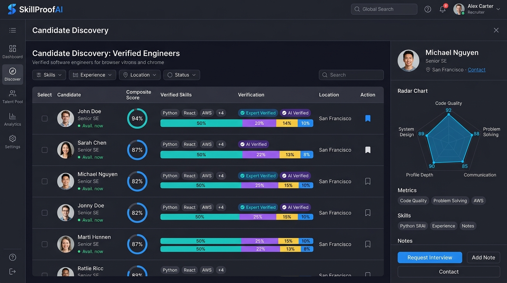
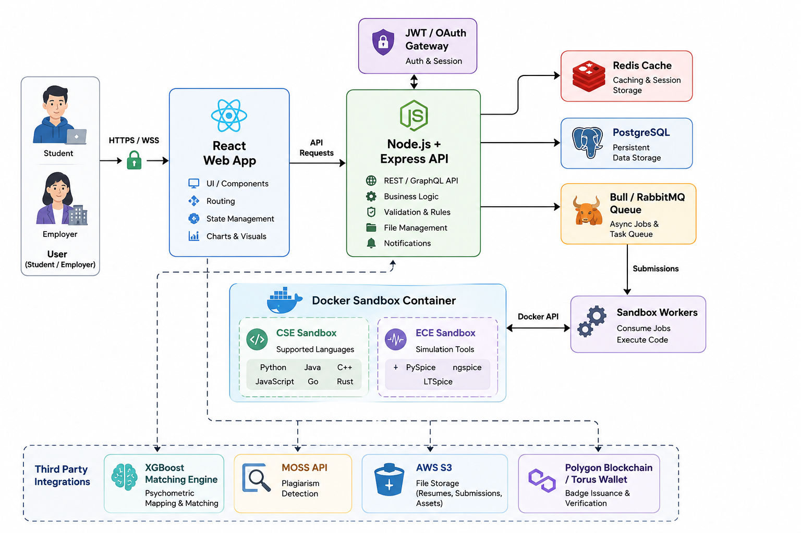

# SkillProofAI — Verified Skill Proof Platform

SkillProofAI is a performance-verified talent marketplace for engineering students. It replaces generic resumes with verified code proofs evaluated through high-fidelity sandbox simulations, automated behavioral psychometrics, expert human code reviews, and Polygon blockchain-verified ERC-721 badges.

> **Demo POC** — Full RBAC across Student, Reviewer, Employer, and Admin roles with AI-generated problems, real-time grading, candidate discovery, public portfolio export, AI talent recommendations, and one-click interview scheduling.

---

## 📸 Platform Preview & Screenshots

<div align="center">

### 🛡️ Verified Badges & Candidate Skill Matrix


### 💻 Monaco Code Editor & Real-time Docker Autograder


### 🏢 Employer Talent Discovery & 4-Part Composite Radar


### 🏛️ High-Level System Architecture


</div>

---

## 🔑 Login Credentials (All Roles)

> **Tip**: The `/login` page includes one-click **Quick Demo Login** buttons for all 4 roles pre-filled with `password123`.

| Role | Email | Password | Primary Route |
| :--- | :--- | :--- | :--- |
| **Student (CSE)** | `tkarthikeyan@gmail.com` | `password123` | `/dashboard` |
| **Student (ECE)** | `student@college.edu` | `password123` | `/dashboard` |
| **Senior Reviewer** | `reviewer@talentforge.in` | `password123` *(or `Reviewer123!`)* | `/reviewer` |
| **Employer / Recruiter** | `employer@talentforge.in` | `password123` | `/discover` |
| **System Admin** | `admin@talentforge.in` | `password123` *(or `Admin123!`)* | `/admin` |

---

## ⚡ Quickstart & Deployment Commands

### Step 1: Environment Configuration
```bash
# Copy template environment file
cp .env.example .env
```

### Step 2: Start Infrastructure Services
Spin up PostgreSQL (5439), Redis (6380), and MinIO (9000/9001):
```bash
docker compose up -d
```

### Step 3: Install Monorepo Dependencies
```bash
npm install
cd backend && npm install && cd ..
cd frontend && npm install && cd ..
cd worker && npm install && cd ..
```

### Step 4: Run Database Migrations
Generate Prisma client, sync database schema, and apply shortlist pipeline stage migration:
```bash
npx prisma generate --schema=backend/prisma/schema.prisma
npx prisma db push --schema=backend/prisma/schema.prisma

# Windows environment helper script for shortlist stage migration
.\migrate-hiring-stage.bat
```

### Step 5: Seed Demo Accounts & Problems
Seed default users (Student, Reviewer, Employer, Admin) and 8 engineering problems:
```bash
npm run seed --prefix backend
```

### Step 6: Launch Development Servers

**Option A: One-Click Launcher (Windows)**
```bash
.\run-app.bat
```

**Option B: Manual Multi-Terminal Launch**
```bash
# Terminal 1: Express API (Port 5001)
npm run dev:backend

# Terminal 2: BullMQ Autograder Worker
npm run dev:worker

# Terminal 3: React + Vite Client (Port 5173)
npm run dev:frontend
```

### Service Access URLs
| Service | URL / Port | Credentials / Notes |
| :--- | :--- | :--- |
| **Frontend Application** | [http://localhost:5173](http://localhost:5173) | Primary client web portal |
| **Backend Express API** | [http://localhost:5001](http://localhost:5001) | API Server base URL |
| **API Health Status** | [http://localhost:5001/api/health](http://localhost:5001/api/health) | Health check endpoint |
| **MinIO Storage Console** | [http://localhost:9001](http://localhost:9001) | `minioadmin` / `minioadmin_dev_secret` |


---

Co-authored-by: karthikeyant <tkarthikeyan@gmail.com>
Co-authored-by: NXDigita <nxdigita.official@gmail.com>

---

## 📁 Monorepo Architecture

```
SkillProofAI-POC/
├── backend/                  # Express.js + Prisma ORM + Socket.io + Sentry (Port 5001)
│   ├── prisma/
│   │   ├── schema.prisma     # User, Problem, Submission, Badge, Review, Notification, Shortlist schema
│   │   └── seed.ts           # 8 Problems + 4 user roles seeder
│   └── src/
│       ├── routes/
│       │   ├── auth.ts       # Login, Register, /me, Refresh
│       │   ├── student.ts    # Problems, Submissions, AI Generator, Notifications, AI Summary
│       │   ├── reviews.ts    # Reviewer RBAC queue, Approve/Reject
│       │   ├── employers.ts  # Candidate discovery, Shortlisting, Interview Requests
│       │   ├── public.ts     # Public profile endpoint (unauthenticated)
│       │   └── verify.ts     # Badge verification + OG image
│       └── app.ts            # Server entry + Redis Socket adapter + Sentry + rate limiting
├── frontend/                 # React 18 + Vite + TypeScript Client (Port 5173)
│   └── src/
│       ├── components/       # AppShell (RBAC nav), CopilotDrawer (Global AI Chat), CandidateDrawer, RequireRole guard
│       ├── context/          # AuthContext (role-aware), ThemeContext
│       ├── pages/
│       │   ├── Home.tsx            # Landing page: Hero, How-It-Works, Feature Highlights, Badge Showcase
│       │   ├── Dashboard.tsx       # Student dashboard
│       │   ├── ProblemBoard.tsx    # 8 seeded + AI Problem Generator modal
│       │   ├── ProblemDetail.tsx   # Monaco Editor + AI copilot
│       │   ├── Assessment.tsx      # 20-question psychometric + domain assessments
│       │   ├── Profile.tsx         # Role-tailored profiles (Student/Reviewer/Employer/Admin)
│       │   ├── PublicProfile.tsx   # Public candidate profile (/p/:id) — PDF export, LinkedIn share
│       │   ├── ReviewerPortal.tsx  # Review queue, Monaco read-only viewer, star rating
│       │   ├── EmployerDiscover.tsx # Candidate discovery with TanStack Table + Smart Match AI
│       │   ├── EmployerShortlist.tsx# Saved shortlist management
│       │   ├── Leaderboard.tsx     # Ranked podium + trends
│       │   ├── Submissions.tsx     # Attempt history + sparkline
│       │   └── Guide.tsx           # Platform help & architecture guide
│       └── services/
│           └── api.ts        # All API calls
├── worker/                   # BullMQ Sandboxed Autograder & Container Runner
│   └── src/grader/           # correctness.ts, complexity.ts, style.ts, precheck.ts
├── load-test/                # Artillery 20-concurrent submission load test (p95 < 5s)
├── sandbox/                  # E2E 10-canned solutions test matrix
└── docker-compose.yml        # PostgreSQL (5439), Redis (6380), MinIO (9000)
```

---

## 🎭 Role-Based Access Control (RBAC)

SkillProofAI implements strict RBAC. Each role sees only its authorized screens and navigation.

| Role | Home Route | Access |
| :--- | :--- | :--- |
| **STUDENT** | `/dashboard` | Problems, Submissions, Leaderboard, Assessment, Profile, Guide, Public Profile |
| **REVIEWER** | `/reviewer` | Review Queue, Read-only Monaco Code Viewer, Approve/Reject |
| **EMPLOYER** | `/discover` | Candidate Discovery, Candidate Inspect Drawer, Shortlist, Interview Requests, Profile |
| **ADMIN** | `/admin` | Platform health, all routes |

`RequireRole.tsx` guards enforce role-specific route access. Unauthorized URL navigation redirects to the role's home page.

---

## ✨ Feature Summary

### 🧑‍💻 Student Workflow
- **Problem Board**: 8 seeded engineering challenges (Explorer → Builder → Architect tiers) + AI-generated problems on demand.
- **AI Problem Generator**: Click "✨ Generate AI Problem" to prompt the active AI model adapter (Ollama llama3 / Claude / Gemini) to create a new problem with hidden test cases, then open it in Monaco Editor.
- **Monaco Editor**: Syntax-highlighted code editor with Python/JavaScript/Java language support.
- **AI Copilot**: A globally available AI mentor drawer that streams contextual advice and suggested prompts based on the current page or problem.
- **Sandbox Grading**: BullMQ worker grading with Security Precheck → Correctness → Big-O Complexity → Style score.
- **Real-time Results**: Socket.io live `grading:complete` event → Results panel with score breakdown.
- **Submission Cooldown**: 60-second resubmit lockout with live countdown chip.
- **Leaderboard**: Paginated podium (Gold/Silver/Bronze) with 7-day score trends.
- **Psychometric Assessment**: 20-question behavioral quiz + domain knowledge test with a 5-trait radar chart.
- **GitHub Integration**: Automated fetching of public repos, followers, and account age to calculate a GitHub Score.
- **AI Talent Profile**: A comprehensive profile featuring verified skills, resume parsing (live on every page visit), GitHub/Social links, and a public/private recruiter visibility toggle.
- **AI Executive Recommendation**: On-demand AI-generated executive summary written from resume, skills, badges, and tier — stored in DB and displayed on every profile visit without re-invoking the AI model.
- **Public Portfolio** (`/p/:id`): A beautifully formatted, shareable public profile page with verified skills, badges, AI recommendation, and portfolio links.
- **PDF Export**: Print-optimized CSS allows the public profile to be exported as a professional PDF resume directly from the browser.
- **LinkedIn Share**: Pre-fills a LinkedIn post with the profile URL and verification hashtags for easy one-click sharing.

### 🔍 Reviewer Workflow
- **Review Queue**: `GET /reviews/queue` — oldest `AI_VERIFIED` submissions first.
- **Code Viewer**: Read-only Monaco editor with submission code loaded.
- **Evaluation**: Star rating (1–5) + comment + Approve/Reject decision.
- **Outcomes**: APPROVE → `EXPERT_VERIFIED`; REJECT → badge revoked + student notification.

### 🏢 Employer Workflow
- **Candidate Discovery** (`/discover`): TanStack Table with sortable aggregate score, badge toggle, min-score slider, language filter.
- **Candidate Inspect Drawer**: Comprehensive profile (education, social links, verified skills), 4-part Aggregate Score Breakdown Tooltip (Profile 15% + GitHub 10% + Code 50% + Psychometric 25%), Psychometric Radar Chart, and best code sample inspection.
- **One-Click Interview Scheduler**: Employers can click "Request Interview" inside the drawer, enter a Calendly or calendar scheduling link with an optional note, and instantly send an in-app notification to the student's dashboard.
- **Smart Match AI** (`/discover`): Paste a job description and let the AI rank candidates by skill fit.
- **Shortlist Page** (`/shortlist`): Saved candidates with remove action.
- **Profile Visibility**: Code samples only shown if `profilePublic=true`.

### 🛡️ Admin Workflow
- **Platform Health Dashboard**: Active users count, daily sandbox executions, S3 backup cron status, AI adapter config.
- **AI Adapter Management**: Runtime switch between Ollama / Claude / Gemini / Mock.

### 🏅 Verification & Badges
- **AI Verified Badge** → Expert Review → `EXPERT_VERIFIED` badge chip flips.
- **LinkedIn Share**: OG image per badge + pre-filled LinkedIn post.
- **Polygon ERC-721**: On-chain skill credentials with PolygonScan verification link.

---

## 🤖 AI Adapter System

SkillProofAI uses a pluggable AI adapter pattern. Set `AI_PROVIDER` in `backend/.env`:

```env
AI_PROVIDER="ollama"      # Local Ollama (default)
OLLAMA_HOST="http://localhost:11434"
OLLAMA_MODEL="llama3"

# AI_PROVIDER="claude"    # Anthropic Claude
# AI_PROVIDER="gemini"    # Google Gemini
# AI_PROVIDER="mock"      # Deterministic mock (no external dependency)
```

AI is used for:
- **Problem Generation**: `POST /api/students/problems/generate-ai` creates new problems from topics
- **AI Feedback**: `POST /api/students/feedback/format` — 3-bullet coaching bullets
- **AI Copilot**: Monaco sidebar chat for in-editor coding assistance
- **AI Executive Recommendation**: `POST /api/students/profile/ai-summary` — generates & persists a professional candidate summary (runs once, cached in DB)
- **Learning Path**: Personalized study milestones from psychometric results
- **Smart Match**: `POST /api/employers/evaluate-match` — compares JD against candidate profiles

---

## 📡 API Reference

### Auth
| Method | Endpoint | Description | Auth |
| :--- | :--- | :--- | :--- |
| `POST` | `/api/auth/login` | Login — returns JWT access + refresh tokens | No |
| `POST` | `/api/auth/register` | Register new account | No |
| `GET` | `/api/auth/me` | Get current user + role | Yes |
| `POST` | `/api/auth/refresh` | Refresh access token | No |

### Student Problems
| Method | Endpoint | Description | Auth |
| :--- | :--- | :--- | :--- |
| `GET` | `/api/students/problems` | Problem catalog (8 seeded + AI generated) | No |
| `GET` | `/api/students/problems/:slug` | Single problem details | No |
| `POST` | `/api/students/problems/generate-ai` | AI generate new problem with hidden test cases | No |
| `POST` | `/api/students/problems/:id/submit` | Enqueue code submission | Yes |

### Student Data & Profile
| Method | Endpoint | Description | Auth |
| :--- | :--- | :--- | :--- |
| `GET` | `/api/students/profile` | Full student profile including `aiSummary` | Yes |
| `PUT` | `/api/students/profile` | Update profile data | Yes |
| `POST` | `/api/students/profile/ai-summary` | Generate & persist AI executive recommendation | Yes |
| `POST` | `/api/students/profile/parse-resume` | Upload and AI-parse PDF resume | Yes |
| `GET` | `/api/students/submissions` | Submission history + scores | Yes |
| `GET` | `/api/students/leaderboard` | Paginated rankings + podium | Yes |
| `GET` | `/api/students/notifications` | Notification bell — unread count + messages | Yes |
| `POST` | `/api/students/feedback/format` | AI 3-bullet coaching feedback | No |
| `POST` | `/api/students/assessment` | Submit psychometric answers | Yes |

### Public Profile
| Method | Endpoint | Description | Auth |
| :--- | :--- | :--- | :--- |
| `GET` | `/api/public/profile/:id` | Publicly accessible candidate profile | No |

### AI Copilot & Embedding
| Method | Endpoint | Description | Auth |
| :--- | :--- | :--- | :--- |
| `POST` | `/api/copilot/chat` | SSE streaming AI chat with page context injection | Yes |
| `POST` | `/api/internal/embed-profiles` | Extract skills + embed profile text via pgvector | INTERNAL |

### Reviews (Reviewer RBAC)
| Method | Endpoint | Description | Auth |
| :--- | :--- | :--- | :--- |
| `GET` | `/reviews/queue` | Queue of AI_VERIFIED submissions (oldest first) | REVIEWER |
| `POST` | `/reviews/:id` | Submit `{stars, comment, verdict: APPROVE/REJECT}` | REVIEWER |

### Employer Discovery
| Method | Endpoint | Description | Auth |
| :--- | :--- | :--- | :--- |
| `GET` | `/api/employers/candidates` | Discover candidates `?minScore=&badge=&language=` | EMPLOYER |
| `GET` | `/api/employers/shortlist` | Get shortlisted candidates | EMPLOYER |
| `POST` | `/api/employers/shortlist` | Shortlist a candidate | EMPLOYER |
| `DELETE` | `/api/employers/shortlist/:id` | Remove from shortlist | EMPLOYER |
| `POST` | `/api/employers/request-interview` | Send interview request notification to candidate | EMPLOYER |
| `POST` | `/api/employers/evaluate-match` | AI match score against job description | EMPLOYER |

### Verification
| Method | Endpoint | Description | Auth |
| :--- | :--- | :--- | :--- |
| `GET` | `/api/verify/:id` | Verify badge by ID | No |
| `GET` | `/api/verify/:id/og-image` | SVG OG image for LinkedIn share | No |

---

## 🗄️ 8 Seeded Problems

| # | Title | Tier | Reward | Key Concept |
| :--- | :--- | :--- | :--- | :--- |
| 1 | Two Sum | Explorer | 100 XP | Hash map O(N) |
| 2 | LRU Cache System | Builder | 150 XP | Doubly-linked list + HashMap |
| 3 | Token Bucket Rate Limiter | Builder | 150 XP | Multi-client token refill |
| 4 | **Build a Load Balancer** ⭐ | **Architect** | **250 XP** | **10 hidden test cases: Round-Robin, Weighted, Health-Check Eviction** |
| 5 | LSM-Tree MemTable & SSTable | Architect | 250 XP | Write-ahead log flushing |
| 6 | Distributed Lock Manager | Architect | 250 XP | TTL lease auto-expiration |
| 7 | Trie Autocomplete Engine | Builder | 150 XP | Prefix search O(L) |
| 8 | Consistent Hashing Ring | Architect | 250 XP | Virtual node ring partitioning |

---

## 🔬 Grading Pipeline

```
User submits code
       │
       ▼
[1] Security Precheck (precheck.ts)
    └─ Block: subprocess, eval, Runtime.exec, fs, child_process
       │ BLOCKED → Immediate fail, no container spawned
       │
       ▼
[2] MinIO S3 Upload → BullMQ Enqueue
       │
       ▼
[3] Docker Container Spawn
    ├─ Correctness: run vs public + hidden test cases
    ├─ Complexity: execute at N, 2N, 4N → fit O() class
    └─ Style: pylint / eslint / checkstyle → 0–100
       │
       ▼
[4] Composite Score = 60% Correctness + 30% Complexity + 10% Style
       │
       ▼
[5] Socket.io grading:complete event → Frontend ResultsPanel
       │
       ▼
[6] Score ≥ Threshold → AI_VERIFIED badge
       │
       ▼
[7] Reviewer Queue → APPROVE → EXPERT_VERIFIED + Polygon ERC-721 NFT
                   → REJECT  → Badge revoked + Notification
```

---

## 🆕 Recent Updates

### 🚀 v1.2 Updates — Trust, Compliance & Architecture Hardening
| Feature / Upgrade | Description |
| :--- | :--- |
| **Developer Console Signature** | Injects styled branding, author coordinates (Karthikeyan T `@carthworks`), Apache-2.0 license, and interactive `window.SkillProofAI.help()` inspection helpers directly in the DevTools console. |
| **Web Trust & Legal Suite** | Six dedicated legal pages: `/about`, `/contact`, `/privacy`, `/terms`, `/refund`, and `/pricing` with transparent candidate & employer tiers. |
| **Cookie Consent Banner** | GDPR/ePrivacy compliant banner with essential vs. analytics choices and localStorage persistence. |
| **Account Agreement Consent** | Mandatory Terms of Service & Privacy Policy acknowledgment on both Candidate and Recruiter sign-up forms. |
| **REST API Standardization** | Distributed `X-Request-Id` trace IDs, structured error payloads (`{ error: { code, message, details, requestId } }`), and centralized production error handling. |
| **Admin Portal & Auto-Provisioning** | Dedicated `/admin` view with sidebar integration and auto-provisioning for `admin@talentforge.in` on first login. |
| **Automated Environment Setup** | Automated `.env` generation from `.env.example` via `run-app.bat` and development fallbacks for `DATABASE_URL` preventing Prisma initialization issues. |
| **Production SEO & Social Meta** | Brand SVG favicon (`/favicon.svg`), `robots.txt`, `sitemap.xml`, and dynamic Open Graph & Twitter Cards across all public routes. |

### 📦 v1.1 Updates — Portfolio & Recruiter Tools
| Feature | Description |
| :--- | :--- |
| **Public Portfolio Page** | `/p/:id` — shareable, print-optimized public profile with verified skills, AI recommendation, badges, and resume data |
| **PDF Export** | Print-to-PDF from the public profile page using browser's native print dialog |
| **LinkedIn Share (Pre-filled)** | Opens a pre-filled LinkedIn post with the profile link and SkillProofAI hashtags |
| **AI Executive Recommendation** | AI-generated professional summary cached in DB — only generated once, displayed on every profile visit |
| **Resume Live Parsing** | Resume tab in profile shows parsed data every page visit without re-uploading |
| **One-Click Interview Scheduler** | Employers can send a Calendly/calendar link to any candidate via in-app notification directly from the Candidate Inspect Drawer |
| **Smart Match AI** | Employer can paste a Job Description and get AI-ranked candidate match scores |
| **Aggregate Score Tooltip** | Hover on any candidate's score in the drawer to see the full formula breakdown (Profile 15% + GitHub 10% + Code 50% + Assessment 25%) |

---

## 📊 Platform Health & Observability

- **Sentry**: Error tracking in both `backend` and `worker` services.
- **BullMQ**: `stalledInterval: 15s`, `maxStalledCount: 2`. Candidate errors fail fast (0 retries); infra errors retry ×2.
- **Rate Limiting**: `express-rate-limit` + Redis — 100 req / 15 min on public routes.
- **Nightly Backup**: `pg_dump | gzip | aws s3 cp` with 14-day S3 retention.
- **PG Indexes**: `Badge.status`, `Submission.totalScore` for fast employer discovery queries.
